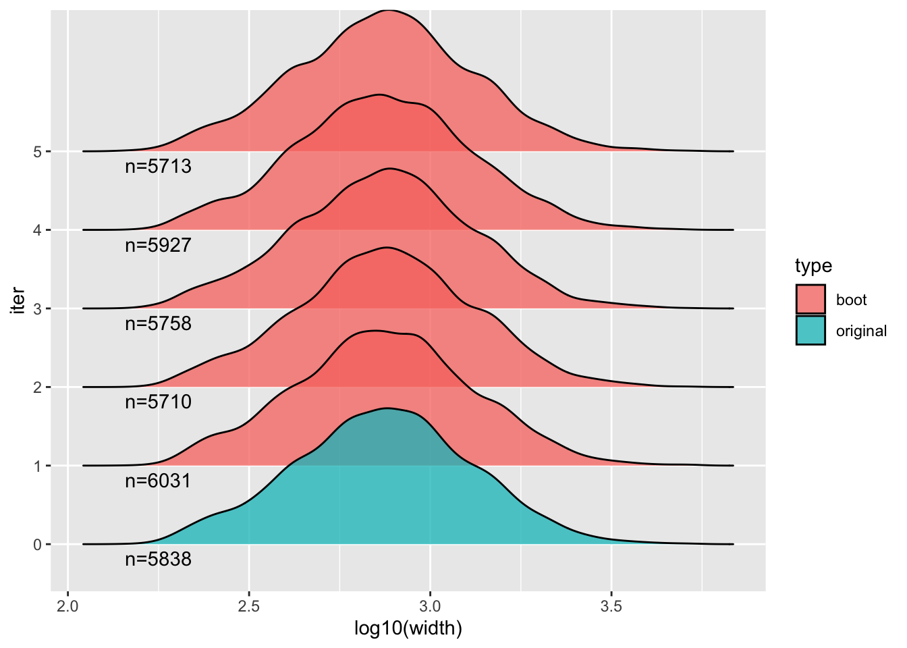

# Bootstrap overlap

Objective: determine if one set of peaks are overlapping another set
of peaks more or less than expected when comparing to sets of *null*
features.

The null features can be generated in a variety of ways -- here we
will generate them by resampling large blocks of one of the peak
sets. The motivation for sampling blocks, instead of placing features
uniformly along the chromosome ("shuffling"), is to better preserve
inter-feature distances, because genomic features tend to cluster in
the genome, even after considering things like excluded regions. This
technique of generating null feature sets is called 
*block bootstrap resampling*, and we will use the *nullranges*
implementation of the block bootstrapping algorithm [@Mu2023] to
generate the null features, followed by overlap analysis with
*plyranges* [@Lee2019].  The approach used in *nullranges* to generate
bootstrap ranges closely follows the GSC method proposed by
@bickel2010.

Note that an alternative approach for null hypothesis comparisons is to
define a set of *covariate-matched ranges*, an approach also implemented
in the *nullranges* package and described in @Davis2023. For examples
of using matching with ranges, see the related articles
[here](https://nullranges.github.io/nullranges/).

We start by loading the ENCODE kidney and bladder H3K27ac ChIP-seq
peaks used in the previous analysis [@encode].


```r
library(AnnotationHub)
ah <- AnnotationHub()
kidney_pks <- ah[["AH43443"]]
bladder_pks <- ah[["AH44180"]]
```


We will additionally obtain an excluded region set, so that we avoid
placing bootstrap features into regions of the genome that don't
typically have features. A variety of possible exclude lists are
provided by the *excluderanges* packages and available via
*AnnotationHub*. Here we will use the 
`hg19.Crawford.wgEncodeDukeMapabilityRegionsExcludable` regions, as
they are available for hg19, which is the genome used with the peak
sets.


```r
# query(ah, c("excluderanges","hg19"))
exclude <- ah[["AH95912"]]
save("data/exclude.rda")
```


To make the code more generic, we will rename the kidney peaks to `x`
and the bladder peaks to `y`. We will be looking for overlaps with
features in `x` as the query set: how many of the features in `x`
overlap features in `y`?

The following code reduces our analysis to looking only at standard
chromosomes, excluding the mitochondrial genome (too small for
including in the block bootstrap). 


```r
library(GenomeInfoDb)
x <- kidney_pks
y <- bladder_pks
x <- keepStandardChromosomes(x)
seqlevels(x, pruning.mode="coarse") <- setdiff(seqlevels(x), "chrM")
seqlevels(y, pruning.mode="coarse") <- seqlevels(x)
seqlevels(exclude, pruning.mode="coarse") <- seqlevels(x)
```

We are mostly concerned with avoiding placing bootstrapped features in
large regions in the exclude list, so we subset the exclude list to
features larger than 500 bp. Why do we have `plyranges::` in front of
`filter`? This is because there is a function in the *ensembldb* 
package that is also called *filter*, so it's a bit safer if we are
using both packages to use the package name.


```r
library(plyranges)
exclude <- exclude %>%
  plyranges::filter(width(exclude) >= 500)
```

We also subset to the peaks for kidney and bladder which have q-value
less than 0.001 and signal value greater than 9 (these are arbitrary
filter values, just for demonstration).

For further analysis, we will need the features in `y` to be sorted,
for the bootstrapping, here we sort both sets.


```r
q_thr <- 3
s_thr <- 9
x <- x %>% 
  plyranges::filter(qValue > q_thr & signalValue > s_thr) %>%
  sort()
y <- y %>% 
  plyranges::filter(qValue > q_thr & signalValue > s_thr) %>%
  sort()
```

Now we can assess how many overlaps we observed between `x` and `y`:


```r
obs <- x %>% mutate(n_overlaps = count_overlaps(., y))
obs %>% summarize(total = sum(n_overlaps))
```

```
## DataFrame with 1 row and 1 column
##       total
##   <integer>
## 1      5073
```

```r
table( obs$n_overlaps )
```

```
## 
##    0    1    2    3    4    6 
## 9453 3966  486   39    3    1
```

We can check if any of the features of `y` fall in the excluded
regions: 


```r
y %>% mutate(n_overlaps = count_overlaps(., exclude)) %>%
  summarize(total = sum(n_overlaps))
```

```
## DataFrame with 1 row and 1 column
##       total
##   <integer>
## 1         0
```

The following chunk of code does the bootstrapping of features in
`y`. Here we subset first to metadata columns of interest (an `id`
variable that we create, and the signal value which we rename to
`signal`). 


```r
pks_to_boot <- y %>%
  mutate(id = seq_along(.)) %>%
  plyranges::select(id, signal = signalValue)
```

The `bootRanges` function returns the bootstrap feature sets
combined into one *GRanges* object -- this tidy format facilitates
downstream analysis as we will see. The bootstrap iteration is stored
in the `iter` metadata column.


```r
library(nullranges)
R <- 30 # number of iterations
set.seed(5) # set seed for reproducibility
boots <- bootRanges(pks_to_boot, blockLength=5e5, R=R, exclude=exclude)
boots
```

```
## BootRanges object with 174764 ranges and 3 metadata columns:
##            seqnames            ranges strand |        id    signal  iter
##               <Rle>         <IRanges>  <Rle> | <integer> <numeric> <Rle>
##        [1]     chr1   2011397-2011809      * |       931  14.42934     1
##        [2]     chr1   2011973-2012399      * |       932  17.57052     1
##        [3]     chr1   2012505-2013073      * |       933   9.64691     1
##        [4]     chr1   2503670-2505748      * |      3752  20.84181     1
##        [5]     chr1   2505855-2507134      * |      3753  15.29241     1
##        ...      ...               ...    ... .       ...       ...   ...
##   [174760]     chrY 57499850-57501632      * |      5141  10.09210    30
##   [174761]     chrY 57937341-57937960      * |      1062  15.98656    30
##   [174762]     chrY 58145916-58146540      * |       264  15.23097    30
##   [174763]     chrY 58146662-58147585      * |       265  12.26661    30
##   [174764]     chrY 58214091-58214746      * |       266   9.69322    30
##   -------
##   seqinfo: 24 sequences from hg19 genome
```

The default use above of the `exclude` argument is to drop bootstrapped
ranges that overlap the exclude list.

We can examine properties of permuted `y` over iterations, and compare
to the original `y`. To do so, we first add the original features as
`iter=0`.


```r
combined <- pks_to_boot %>% 
  mutate(iter=0) %>%
  bind_ranges(boots) %>% 
  plyranges::select(iter)
```

Then compute summaries:


```r
library(tibble)
stats <- combined %>% 
  group_by(iter) %>%
  summarize(n = n(),
            sum_width=sum(width)/1e6) %>%
  as_tibble()
```

Original `y` vs bootstrap:


```r
stats[1,]
```

```
## # A tibble: 1 × 3
##   iter      n sum_width
##   <fct> <int>     <dbl>
## 1 0      5838      5.07
```

```r
summary(stats[-1,])
```

```
##       iter          n          sum_width    
##  1      : 1   Min.   :5595   Min.   :4.843  
##  2      : 1   1st Qu.:5723   1st Qu.:4.968  
##  3      : 1   Median :5825   Median :5.042  
##  4      : 1   Mean   :5825   Mean   :5.057  
##  5      : 1   3rd Qu.:5910   3rd Qu.:5.130  
##  6      : 1   Max.   :6053   Max.   :5.295  
##  (Other):24
```

We can also look at distributions of various aspects, e.g. here the
width of features, across a few of the bootstraps and the original
feature set `y`.


```r
library(ggplot2)
library(ggridges)
combined %>% plyranges::filter(iter %in% 0:5) %>%
  plyranges::select(iter) %>%
  as_tibble() %>%
  mutate(type = ifelse(iter == 0, "original", "boot")) %>%
  ggplot(aes(log10(width), iter, fill=type)) +
  geom_density_ridges(alpha = 0.75) +
  geom_text(data=head(stats),
            aes(x=2.25, y=iter, label=paste0("n=",n), fill=NULL),
            vjust=1.5)
```



To compute overlap with the null features, we need the `complete()`
function from the *tidyr* package. We saw `complete()` before -- this
is used in the case that one of the iterations has no overlaps. In
this case, we need to record the 0 value for proper inference and
plots downstream. It is rare we would have no overlaps with so many
features as we have in `x` and `y` but it's good practice to leave the
`complete()` as part of the workflow so the code works correctly in
all cases.

The overlap per iteration of the bootstrap is accomplished by a series
of *plyranges* / *dplyr* commands (we switch to *dplyr* halfway
through, after the `as_tibble()` call).


```r
library(tidyr)
null <- x %>% join_overlap_inner(boots) %>%
  group_by(iter) %>%
  summarize(n_overlaps = n()) %>%
  as_tibble() %>%
  complete(iter, fill=list(n_overlaps = 0))
head(null)
```

```
## # A tibble: 6 × 2
##   iter  n_overlaps
##   <fct>      <int>
## 1 1             60
## 2 2             60
## 3 3             76
## 4 4             51
## 5 5             39
## 6 6             66
```


```r
sum( obs$n_overlaps )
```

```
## [1] 5073
```

The observed number of overlaps is about two orders of magnitude more
than the bootstrapped number, which makes sense as two tissues would
be expected to share a number of similar regulatory regions (as marked
by H3K27ac) -- more so than randomly placed genomic features, even
after accounting for excluded regions and feature clustering.


```r
ggplot(null, aes(n_overlaps)) +
  geom_histogram(binwidth=5) +
  ggtitle("bootstrap overlaps")
```


What could be improved with this analysis?

Note that in the above chunks where we count overlaps, we are doubly
(or triply, etc.) counting features in `x` if they hit more than one
feature in `y` or `boots`. We can count statistics per `x` feature by
adding another `group_by` into the stream of operations. This also
allows us to do more complex operations, such as computing the
maximum signal value for the overlapping features in `y` per feature
in `x`:

First add an ID variable to keep track of `x` features:


```r
x <- x %>% mutate(x_id = seq_along(x))
```

Then perform an inner join, and group by the new `x` ID:


```r
obs <- x %>% join_overlap_inner(pks_to_boot) %>%
  group_by(x_id) %>%
  summarize(num_overlaps = n(),
            max_signal = max(signal))
sum( obs$num_overlaps > 0 )
```

```
## [1] 4495
```

```r
summary( obs$max_signal )
```

```
##    Min. 1st Qu.  Median    Mean 3rd Qu.    Max. 
##   9.002  10.281  12.025  13.029  14.725  35.211
```

For the bootstrap ranges overlap step, we also need to add `iter` to
the initial `group_by`, so we count per `x` feature and per iteration
of the bootstrap:


```r
null <- x %>% join_overlap_inner(boots) %>%
  group_by(x_id, iter) %>%
  summarize(num_overlaps = n()) %>%
  as_tibble() %>%
  group_by(iter) %>%
  summarize(any_hits = sum(num_overlaps > 0)) %>%
  complete(iter, fill=list(any_hits = 0))
head(null)
```

```
## # A tibble: 6 × 2
##   iter  any_hits
##   <fct>    <int>
## 1 1           55
## 2 2           55
## 3 3           68
## 4 4           50
## 5 5           37
## 6 6           63
```

Still, we are seeing much more overlap in the observed data than in
the bootstrap data:


```r
sum( obs$num_overlaps > 0 ) /
  mean(null$any_hits)
```

```
## [1] 76.75014
```

The above code chunk then avoids double counting. We could also have
made other per-`x`-feature statistics in the summarize step after the
initial `group_by`, such as maximum signal of overlapping features.

What other ways could we have done this analysis? Suppose we don't
just want the count of overlaps, but the rate of overlaps from the `y`
perspective, keeping track of the variable number of features per
bootstrap.

We demonstrate one approach to obtain this rate for the bootstraps:


```r
x_thin <- x %>% plyranges::select(x_id)
null <- boots %>% plyranges::select(id, iter) %>%
  join_overlap_inner(x_thin) %>%
  group_by(id, iter) %>%
  summarize(num_overlaps = n()) %>%
  as_tibble() %>%
  group_by(iter) %>%
  summarize(any_hits = sum(num_overlaps > 0)) %>%
  complete(iter, fill=list(any_hits = 0))
```

Now combine with the per-iteration total count:


```r
totals <- boots %>% 
  group_by(iter) %>%
  summarize(total=n()) %>%
  as_tibble()
null %>% dplyr::left_join(totals) %>%
  mutate(rate = any_hits/total)
```

```
## Joining with `by = join_by(iter)`
```

```
## # A tibble: 30 × 4
##    iter  any_hits total    rate
##    <fct>    <int> <int>   <dbl>
##  1 1           59  6031 0.00978
##  2 2           58  5710 0.0102 
##  3 3           73  5758 0.0127 
##  4 4           50  5927 0.00844
##  5 5           37  5713 0.00648
##  6 6           59  5888 0.0100 
##  7 7           58  5910 0.00981
##  8 8           79  5836 0.0135 
##  9 9           59  5770 0.0102 
## 10 10          50  5991 0.00835
## # ℹ 20 more rows
```
