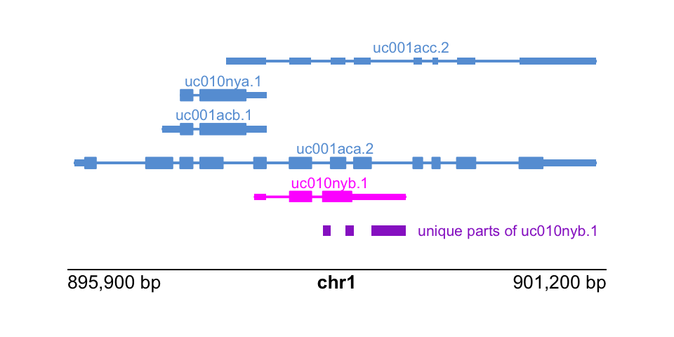

# Isoform analysis

Objective: compare the structure of isoforms within a gene using
grouping and disjoin operations.

There are many packages in Bioconductor that allow for isoform-level
analysis across samples (also called transcript-level analysis).
Packages that facilitate differential transcript analysis include
*DEXSeq* and *DRIMSeq* (demonstrated in the *rnaseqDTU* workflow), and
newer packages *satuRn* and *fishpond*.

Once you've identified isoforms of interest within a gene, perhaps
isoforms that switch in terms of their expression after cells are
treated, one can use the
[IsoformSwitchAnalyzeR](https://github.com/kvittingseerup/IsoformSwitchAnalyzeR)
Bioconductor package to visualize and analyze a set of isoform
switches. For example, one can test the functional consequences of a
set of isoform switches in terms of the gain or loss of protein
domains, or splicing-centric changes (e.g. alternative 3' or 5'
acceptor sites, alternative transcription start or ends sites, etc.)
*IsoformSwitchAnalyzeR* is a multi-feature and mature package for this
type of analysis, but we can perform some simpler within-gene isoform
comparisons using *plyranges*, mostly for demonstration.

Here we will suppose that we have somehow identified isoforms of
interest, and we want to compare these isoforms to other isoforms of
the same gene. For simplicity, we will focus on one isoform per gene,
for a particular set of interesting genes, just picking isoforms at
random for genes on `chr1`. We could use *plyranges* to compare
various metadata about isoforms or exons e.g. RNA-seq or ChIP-seq
coverage, sequence content, etc. But here we will just compare
isoforms alone by the interval definitions. Then to reformulate:

Specific objective 1: compare one isoform per gene to the others, in
terms of the extent from TSS to TES. What makes this isoform distinct?

We will start again with the transcript database we've used before:


```r
library(TxDb.Hsapiens.UCSC.hg19.knownGene)
txdb <- TxDb.Hsapiens.UCSC.hg19.knownGene
txp <- transcripts(txdb)
```

For further operations it will be convenient to have the `tx_id` be a
character variable, and we filter now to a set of genes of interest
(here just picking those on `chr1`):


```r
library(plyranges)
txp <- txp %>%
  mutate(tx_id = as.character(tx_id)) %>%
  filter(seqnames == "chr1")
```

It is sometimes useful to have other identifiers, such as the gene ID
(Entrez)...


```r
txp <- txp %>%
  mutate(gene_id = mapIds(
           txdb, keys=tx_id,
           column="GENEID", keytype="TXID")
         ) %>%
  filter(!is.na(gene_id))
```

...and the gene symbol. For simplicity we will keep genes that have a
non-NA symbol but this step is not necessary.


```r
library(org.Hs.eg.db)
txp <- txp %>%
  mutate(symbol = mapIds(
           org.Hs.eg.db, keys=gene_id,
           column="SYMBOL", keytype="ENTREZID")
         ) %>%
  filter(!is.na(symbol))
```

The following is one way to identify which isoforms belong to
multi-isoform genes:


```r
library(tibble)
tab <- txp %>%
  group_by(gene_id) %>%
  summarize(ntxp = n_distinct(tx_id)) %>%
  as_tibble()
tab
```

```
## # A tibble: 2,324 × 2
##    gene_id    ntxp
##    <chr>     <int>
##  1 10000         3
##  2 100126331     1
##  3 100126346     1
##  4 100126348     1
##  5 100126349     1
##  6 100128071     1
##  7 100128787     1
##  8 100129046     1
##  9 100129138     1
## 10 100129196     1
## # … with 2,314 more rows
```

```r
tab_longer <- dplyr::left_join(tibble(gene_id=txp$gene_id), tab)
txp <- txp %>%
  mutate(ntxp = tab_longer$ntxp)
txp
```

```
## GRanges object with 7177 ranges and 5 metadata columns:
##          seqnames              ranges strand |       tx_id     tx_name     gene_id       symbol
##             <Rle>           <IRanges>  <Rle> | <character> <character> <character>  <character>
##      [1]     chr1         11874-14409      + |           1  uc001aaa.3   100287102      DDX11L1
##      [2]     chr1         11874-14409      + |           2  uc010nxq.1   100287102      DDX11L1
##      [3]     chr1         11874-14409      + |           3  uc010nxr.1   100287102      DDX11L1
##      [4]     chr1         69091-70008      + |           4  uc001aal.1       79501        OR4F5
##      [5]     chr1       323892-328581      + |           8  uc001aau.3   100132062 LOC100132062
##      ...      ...                 ...    ... .         ...         ...         ...          ...
##   [7173]     chr1 249144203-249152264      - |        7963  uc031pta.1       55657       ZNF692
##   [7174]     chr1 249144203-249152912      - |        7964  uc001ifb.2       55657       ZNF692
##   [7175]     chr1 249144203-249153125      - |        7965  uc010pzr.2       55657       ZNF692
##   [7176]     chr1 249144203-249153315      - |        7966  uc001ifc.2       55657       ZNF692
##   [7177]     chr1 249144203-249153315      - |        7967  uc001iff.2       55657       ZNF692
##               ntxp
##          <integer>
##      [1]         3
##      [2]         3
##      [3]         3
##      [4]         1
##      [5]         1
##      ...       ...
##   [7173]         6
##   [7174]         6
##   [7175]         6
##   [7176]         6
##   [7177]         6
##   -------
##   seqinfo: 93 sequences (1 circular) from hg19 genome
```

We can now filter to the multi-isoform genes:


```r
txp <- txp %>%
  filter(ntxp > 1)
```

Here we arbitrarily pick one isoform per gene, first by identifying
those in a tibble...


```r
set.seed(3)
pick_one <- txp %>%
  as_tibble() %>%
  group_by(gene_id) %>%
  slice(sample.int(n(), size=1)) %>%
  dplyr::pull(tx_id)
```

...then we can label these in our `txp` object. We will track these
with an integer, 1 for the isoform of interest, and 0 for the others.


```r
txp <- txp %>%
  mutate(the_one = as.integer(tx_id %in% pick_one))
```

To identify which "parts" of the TSS-to-TES interval belong to which
isoform, we can use `disjoin_ranges`. This breaks up the ranges, here
grouped by gene, into distinct parts, and labels those according to
whatever metadata variables we specify. Here we specify to combine
`tx_id` into a collapsed string, but we could also perform numeric
operations, e.g. `min` or `mean` etc. And we can specify more than one
new variable to be created during the `disjoin_ranges` operation. As
with `reduce_ranges`, this operation can be `_directed` or not.


```r
txp %>%
  group_by(gene_id) %>%
  disjoin_ranges(tx_ids = paste(tx_id,collapse=","))
```

```
## GRanges object with 4438 ranges and 2 metadata columns:
##          seqnames              ranges strand |     gene_id                 tx_ids
##             <Rle>           <IRanges>  <Rle> | <character>            <character>
##      [1]     chr1         11874-14409      * |   100287102                  1,2,3
##      [2]     chr1       367659-368597      * |      729759                     11
##      [3]     chr1       621096-622034      * |      729759                   4099
##      [4]     chr1       762971-763177      * |      643837         14,15,16,17,18
##      [5]     chr1       763178-778984      * |      643837      14,15,16,17,18,19
##      ...      ...                 ...    ... .         ...                    ...
##   [4434]     chr1 249144203-249150234      * |       55657 7962,7963,7964,7965,..
##   [4435]     chr1 249150235-249152264      * |       55657 7963,7964,7965,7966,..
##   [4436]     chr1 249152265-249152912      * |       55657    7964,7965,7966,7967
##   [4437]     chr1 249152913-249153125      * |       55657         7965,7966,7967
##   [4438]     chr1 249153126-249153315      * |       55657              7966,7967
##   -------
##   seqinfo: 93 sequences (1 circular) from hg19 genome
```

Here we try to answer the specific objective, by labeling which parts
belong exclusively to the isoform of interest by computing
`min(the_one)` (try to convince yourself that this does in fact
identify these intervals).


```r
txp %>%
  group_by(gene_id) %>%
  disjoin_ranges(the_one_parts = min(the_one)) %>%
  filter(the_one_parts > 0)
```

```
## GRanges object with 257 ranges and 2 metadata columns:
##         seqnames              ranges strand |     gene_id the_one_parts
##            <Rle>           <IRanges>  <Rle> | <character>     <integer>
##     [1]     chr1       621096-622034      * |      729759             1
##     [2]     chr1     2407754-2411622      * |        9651             1
##     [3]     chr1     2495189-2495267      * |        8764             1
##     [4]     chr1     3689334-3689351      * |      388588             1
##     [5]     chr1     6268367-6268677      * |      388591             1
##     ...      ...                 ...    ... .         ...           ...
##   [253]     chr1 243651535-243663020      * |       10000             1
##   [254]     chr1 244571794-244586136      * |         159             1
##   [255]     chr1 246580715-246670644      * |       64754             1
##   [256]     chr1 247492918-247495045      * |       84838             1
##   [257]     chr1 249119835-249120154      * |       80851             1
##   -------
##   seqinfo: 93 sequences (1 circular) from hg19 genome
```

Do the parts identified make sense if we check one gene?


```r
txp %>%
  filter(gene_id == "9651")
```

```
## GRanges object with 6 ranges and 6 metadata columns:
##       seqnames          ranges strand |       tx_id     tx_name     gene_id      symbol      ntxp
##          <Rle>       <IRanges>  <Rle> | <character> <character> <character> <character> <integer>
##   [1]     chr1 2407754-2436964      + |         134  uc001aji.1        9651       PLCH2         6
##   [2]     chr1 2411623-2436892      + |         135  uc010nyz.2        9651       PLCH2         6
##   [3]     chr1 2411623-2436964      + |         136  uc009vle.1        9651       PLCH2         6
##   [4]     chr1 2411623-2436965      + |         137  uc001ajj.1        9651       PLCH2         6
##   [5]     chr1 2411623-2436969      + |         138  uc001ajk.1        9651       PLCH2         6
##   [6]     chr1 2430183-2436964      + |         139  uc001ajl.1        9651       PLCH2         6
##         the_one
##       <integer>
##   [1]         1
##   [2]         0
##   [3]         0
##   [4]         0
##   [5]         0
##   [6]         0
##   -------
##   seqinfo: 93 sequences (1 circular) from hg19 genome
```

Let's pause and consider what we've answered so far. We asked, for a
given isoform per gene, what parts (intervals) uniquely define that
isoform, when we just consider TSS-to-TES extent (ignoring the
exonic/intronic structure). We started here mostly for simplicity, but
typically we care about *transcribed* sequence, so let's repeat this
task, now considering what exonic parts are unique to one isoform per
gene.

Specific objective 2: compare one isoform per gene to the others, in
terms of the exonic intervals. What makes this isoform distinct?

To start, we will need a list of the exons, grouped by transcript.


```r
ebt <- exonsBy(txdb, by="tx")
ebt <- ebt[txp$tx_id] # subset to those txp/genes of interest
```

Here, we could have also used `bind_ranges` but I find that for very
large lists of ranges, `unlist` is faster:


```r
exons <- unlist(ebt) %>%
  select(exon_id, exon_rank) %>%
  mutate(tx_id = rep(names(ebt), lengths(ebt)))
exons
```

```
## GRanges object with 67595 ranges and 3 metadata columns:
##        seqnames              ranges strand |   exon_id exon_rank       tx_id
##           <Rle>           <IRanges>  <Rle> | <integer> <integer> <character>
##      1     chr1         11874-12227      + |         1         1           1
##      1     chr1         12613-12721      + |         3         2           1
##      1     chr1         13221-14409      + |         5         3           1
##      2     chr1         11874-12227      + |         1         1           2
##      2     chr1         12595-12721      + |         2         2           2
##    ...      ...                 ...    ... .       ...       ...         ...
##   7967     chr1 249149757-249149834      - |     27460         7        7967
##   7967     chr1 249149579-249149657      - |     27459         8        7967
##   7967     chr1 249148136-249148250      - |     27458         9        7967
##   7967     chr1 249144881-249144980      - |     27457        10        7967
##   7967     chr1 249144203-249144715      - |     27456        11        7967
##   -------
##   seqinfo: 93 sequences (1 circular) from hg19 genome
```

The `exons` ranges are missing some of our key metadata from `txp`. We
can add this, by first `select`-ing what we want from `txp`, turning
this into a tibble and `left_join`-ing to the `exons`. I add an
`all.equal` step to make sure we have the two tables lined up, before
we add the extra columns with `cbind`.

Some of this code wouldn't be necessary for TranscriptDb with more
details `exons` output, as with *ensembldb*.


```r
txp_data <- txp %>%
  select(tx_id, gene_id, ntxp, the_one, .drop_ranges=TRUE) %>%
  as_tibble()
ids <- dplyr::left_join(tibble(tx_id = exons$tx_id),
                        txp_data, by="tx_id")
ids
```

```
## # A tibble: 67,595 × 4
##    tx_id gene_id    ntxp the_one
##    <chr> <chr>     <int>   <int>
##  1 1     100287102     3       1
##  2 1     100287102     3       1
##  3 1     100287102     3       1
##  4 2     100287102     3       0
##  5 2     100287102     3       0
##  6 2     100287102     3       0
##  7 3     100287102     3       0
##  8 3     100287102     3       0
##  9 3     100287102     3       0
## 10 11    729759        2       0
## # … with 67,585 more rows
```

```r
all.equal(exons$tx_id, ids$tx_id)
```

```
## [1] TRUE
```

```r
mcols(exons) <- cbind(mcols(exons), ids %>% select(-tx_id))
exons
```

```
## GRanges object with 67595 ranges and 6 metadata columns:
##        seqnames              ranges strand |   exon_id exon_rank       tx_id     gene_id      ntxp
##           <Rle>           <IRanges>  <Rle> | <integer> <integer> <character> <character> <integer>
##      1     chr1         11874-12227      + |         1         1           1   100287102         3
##      1     chr1         12613-12721      + |         3         2           1   100287102         3
##      1     chr1         13221-14409      + |         5         3           1   100287102         3
##      2     chr1         11874-12227      + |         1         1           2   100287102         3
##      2     chr1         12595-12721      + |         2         2           2   100287102         3
##    ...      ...                 ...    ... .       ...       ...         ...         ...       ...
##   7967     chr1 249149757-249149834      - |     27460         7        7967       55657         6
##   7967     chr1 249149579-249149657      - |     27459         8        7967       55657         6
##   7967     chr1 249148136-249148250      - |     27458         9        7967       55657         6
##   7967     chr1 249144881-249144980      - |     27457        10        7967       55657         6
##   7967     chr1 249144203-249144715      - |     27456        11        7967       55657         6
##          the_one
##        <integer>
##      1         1
##      1         1
##      1         1
##      2         0
##      2         0
##    ...       ...
##   7967         0
##   7967         0
##   7967         0
##   7967         0
##   7967         0
##   -------
##   seqinfo: 93 sequences (1 circular) from hg19 genome
```

We repeat similar code as performed above with `txp`, now identifying
parts of exons that are unique to the isoform of interest, per gene:


```r
exon_parts <- exons %>%
  group_by(gene_id) %>%
  disjoin_ranges(the_one_parts = min(the_one)) %>%
  filter(the_one_parts > 0)
exon_parts
```

```
## GRanges object with 1604 ranges and 2 metadata columns:
##          seqnames              ranges strand |     gene_id the_one_parts
##             <Rle>           <IRanges>  <Rle> | <character>     <integer>
##      [1]     chr1       621096-622034      * |      729759             1
##      [2]     chr1       776580-778984      * |      643837             1
##      [3]     chr1       898412-898488      * |      339451             1
##      [4]     chr1       898634-898716      * |      339451             1
##      [5]     chr1       898885-899229      * |      339451             1
##      ...      ...                 ...    ... .         ...           ...
##   [1600]     chr1 247301447-247302017      * |        7678             1
##   [1601]     chr1 247493268-247493383      * |       84838             1
##   [1602]     chr1 247494734-247495045      * |       84838             1
##   [1603]     chr1 249120034-249120154      * |       80851             1
##   [1604]     chr1 249152521-249152710      * |       55657             1
##   -------
##   seqinfo: 93 sequences (1 circular) from hg19 genome
```

To confirm that we've identified the right parts, let's use
*plotgardener* to visualize a particular gene:


```r
txp %>%
  filter(gene_id == "339451")
```

```
## GRanges object with 5 ranges and 6 metadata columns:
##       seqnames        ranges strand |       tx_id     tx_name     gene_id      symbol      ntxp
##          <Rle>     <IRanges>  <Rle> | <character> <character> <character> <character> <integer>
##   [1]     chr1 895967-901099      + |          55  uc001aca.2      339451      KLHL17         5
##   [2]     chr1 896829-897858      + |          56  uc001acb.1      339451      KLHL17         5
##   [3]     chr1 897009-897858      + |          57  uc010nya.1      339451      KLHL17         5
##   [4]     chr1 897461-901099      + |          58  uc001acc.2      339451      KLHL17         5
##   [5]     chr1 897735-899229      + |          59  uc010nyb.1      339451      KLHL17         5
##         the_one
##       <integer>
##   [1]         0
##   [2]         0
##   [3]         0
##   [4]         0
##   [5]         1
##   -------
##   seqinfo: 93 sequences (1 circular) from hg19 genome
```

```r
tx_to_show <- txp %>%
  filter(gene_id == "339451" & the_one == 1) %>%
  as_tibble() %>%
  dplyr::pull(tx_name)
these_parts <- exon_parts %>%
  filter(gene_id == "339451")
```

We lay out a page zooming into this gene and its isoforms:


```r
library(plotgardener)
par <- pgParams(
  chrom = "chr1", 
  chromstart = 895.9e3, chromend = 901.2e3,
  assembly = "hg19", just = c("left", "bottom")
)
```

We will highlight our isoform of interest:


```r
hilite <- data.frame(transcript=tx_to_show, color="magenta")
```

Finally, putting it all together:


```r
pageCreate(width = 5, height = 2.5, showGuides = FALSE)
plotTranscripts(
  params = par, x = 0.5, y = 1.5, width = 4, height = 1.5,
  transcriptHighlights = hilite
)
plotRanges(
  these_parts, fill="darkorchid",
  params = par, x = 0.5, y = 1.75, width = 4, height = .25
)
label <- paste("unique parts of", tx_to_show)
plotText(
  label = label, fontcolor = "darkorchid",
  params = par, x = 3.1, y = 1.75,
  just = c("left", "bottom"), fontsize = 8
)
plotGenomeLabel(
  params = par, x = 0.5, y = 2, length = 4,
  just = c("left", "top")
)
```



Questions:

-   How else could we have found parts of one isoform per gene, that
    do not belong to any other isoforms of the genes. Would other
    approaches have any limitations?
