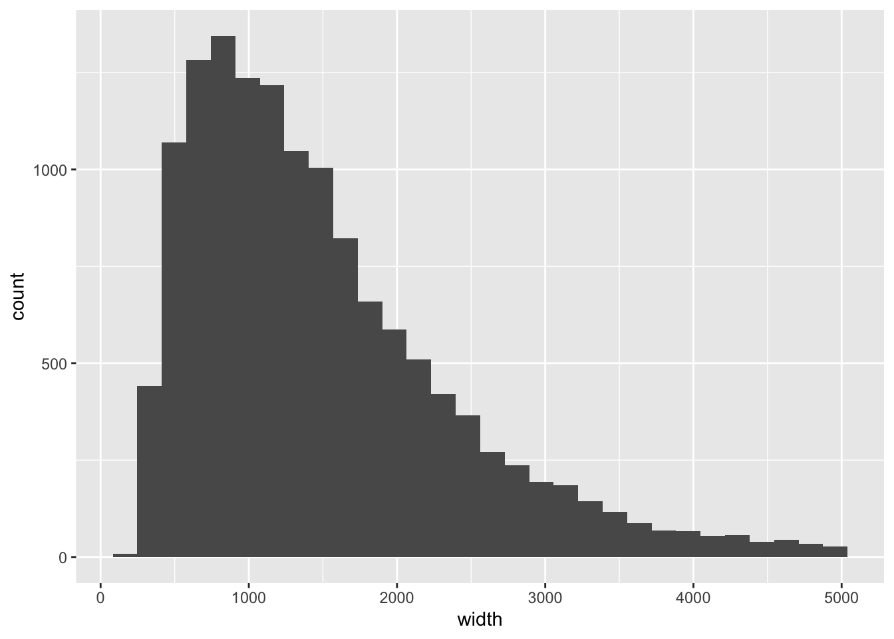
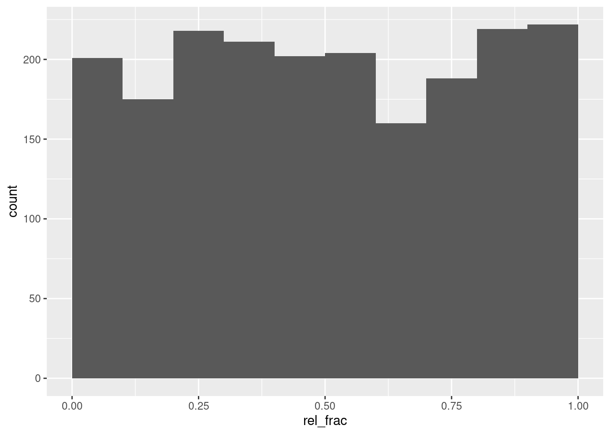
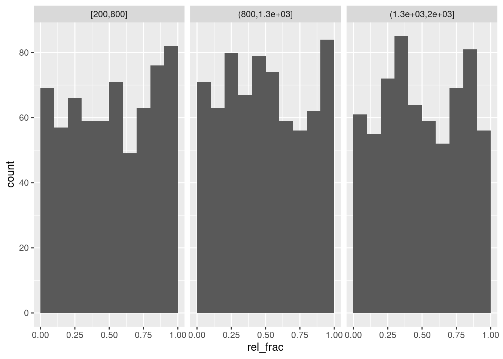

# SNP position in peaks

Objective: determine the position of a set of SNPs in peaks, that is, determine the relative positions of those SNPs that overlap the peaks.

We again will use the ENCODE kidney H3K27ac ChIP-seq peaks used in the previous analysis [@encode]. We will create some artificial SNPs: this analysis could generalize to any time that we have two ranges, where we are interested in the relative position of one set of ranges (SNPs) within the other set of ranges (peaks).


```r
library(AnnotationHub)
ah <- AnnotationHub()
kidney_pks <- ah[["AH43443"]]
```


We will filter the peaks to standard chromosomes, and include the same cutoffs we used in the previous analysis.


```r
suppressPackageStartupMessages(library(GenomeInfoDb))
pks <- kidney_pks
pks <- keepStandardChromosomes(pks)
```

```
## Loading required package: GenomicRanges
```


```r
suppressPackageStartupMessages({
  library(dplyr)
  library(tibble)
  library(plyranges)
})
q_thr <- 3
s_thr <- 9
pks <- pks %>% 
  filter(qValue > q_thr & signalValue > s_thr) %>%
  sort()
```

A histogram of peak width:


```r
library(ggplot2)
pks %>% as_tibble %>%
  filter(width < 5000) %>%
  ggplot(aes(width)) + 
  geom_histogram()
```

```
## `stat_bin()` using `bins = 30`. Pick better value with `binwidth`.
```



Let's subset to peaks that are less than 2000 in width:


```r
pks <- pks %>% filter(width < 2000)
```

Now, we may be interested in SNPs that are associated with regulatory function. While we could find these from a database of chromatin QTL or functionally validated variants, here we will just create a simulated set of SNPs for demonstration.


```r
set.seed(1)
snps <- pks %>% 
  slice(sample.int(n(), 2000)) %>%
  anchor_5p() %>%
  mutate(start=start + floor(runif(n(),0,width))) %>%
  mutate(width=1)
snps
```

```
## GRanges object with 2000 ranges and 6 metadata columns:
##          seqnames    ranges strand |        name     score signalValue    pValue    qValue
##             <Rle> <IRanges>  <Rle> | <character> <numeric>   <numeric> <numeric> <numeric>
##      [1]     chr1 222886667      * |    Rank_786       943    28.06788   94.3437   89.9679
##      [2]    chr17   1251302      * |  Rank_11154       238    10.45065   23.8843   21.0424
##      [3]     chr9  75179753      * |   Rank_8060       305    12.52016   30.5751   27.5376
##      [4]     chrX  70401571      * |   Rank_9602       266    11.38197   26.6991   23.7679
##      [5]    chr20  37615472      * |  Rank_14922       190     9.52741   19.0203   16.3297
##      ...      ...       ...    ... .         ...       ...         ...       ...       ...
##   [1996]     chr9  14316343      * |  Rank_15136       188     9.11715   18.8452   16.1647
##   [1997]    chr18  74800298      * |  Rank_15685       181     9.02626   18.1808   15.5192
##   [1998]    chr19  52641902      * |   Rank_2464       606    19.64891   60.6790   56.9445
##   [1999]     chr2 128642862      * |  Rank_15514       184     9.18719   18.4512   15.7837
##   [2000]     chr6 151005236      * |  Rank_13672       203     9.07738   20.3511   17.6170
##               peak
##          <numeric>
##      [1]       267
##      [2]       458
##      [3]       616
##      [4]       455
##      [5]       414
##      ...       ...
##   [1996]       461
##   [1997]       173
##   [1998]      1281
##   [1999]       125
##   [2000]       887
##   -------
##   seqinfo: 25 sequences (1 circular) from hg19 genome
```

These should all overlap peaks:


```r
snps %>% 
  mutate(n_overlaps = count_overlaps(., pks)) %>%
  summarize(tab=table(n_overlaps))
```

```
## DataFrame with 1 row and 2 columns
##   tab.n_overlaps  tab.Freq
##         <factor> <integer>
## 1              1      2000
```

We now have a bit of a hack for this analysis: we add the start position and width of the peak as addition columns of metadata. This is because otherwise, we will lose the start position when we perform the overlap of SNPs in peaks, and we need it for later.


```r
pks_trim <- pks %>% 
  select(name) %>%
  mutate(peak_start=start, peak_width=width)
```

We can then obtain overlaps of SNPs with peaks, and add the relative position of the SNP within the peak extent. We use 1-based indexing, such that if the SNP is the same as the leftmost basepair of the peak, it gets counted as position 1.


```r
o <- snps %>% 
  join_overlap_inner(pks_trim) %>%
  mutate(rel_pos = start - peak_start + 1,
         rel_frac = (rel_pos - 1) / (peak_width - 1 ))
```

Check our expectations about these new columns:


```r
all(o$rel_pos >= 1)
```

```
## [1] TRUE
```

```r
all(o$rel_frac >= 0)
```

```
## [1] TRUE
```

```r
all(o$rel_frac <= 1)
```

```
## [1] TRUE
```

Finally, we can compute a histogram of where the SNPs fall in the peaks:


```r
o %>% 
  as_tibble() %>%
  ggplot(aes(rel_frac)) + 
  geom_histogram(breaks=0:10/10)
```



Now stratifying by width of peak:


```r
quantile(o$peak_width, 0:3/3)
```

```
##        0% 33.33333% 66.66667%      100% 
##  246.0000  813.3333 1289.6667 1998.0000
```

```r
o %>%
  mutate(width_bin = cut(peak_width,
                         breaks=c(200,800,1300,2000),
                         include.lowest=TRUE)) %>%
  as_tibble() %>%
  ggplot(aes(rel_frac)) + 
  geom_histogram(breaks=0:10/10) + 
  facet_wrap(~width_bin)
```


